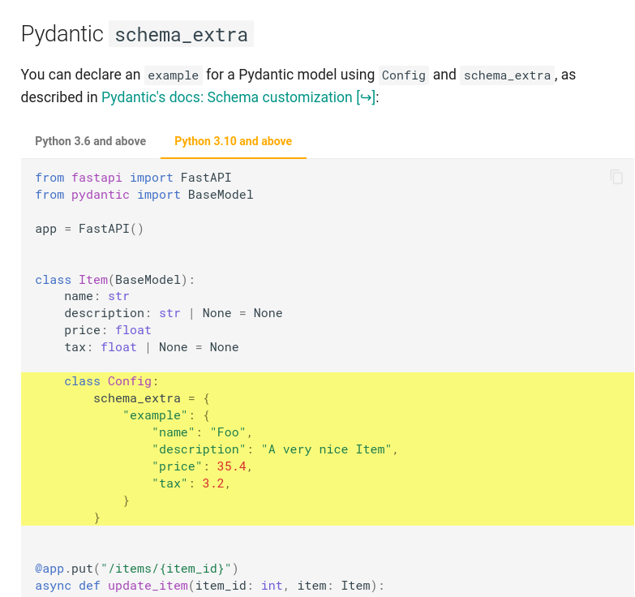
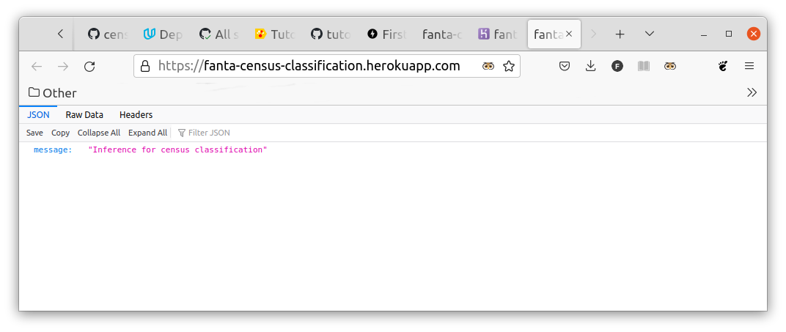
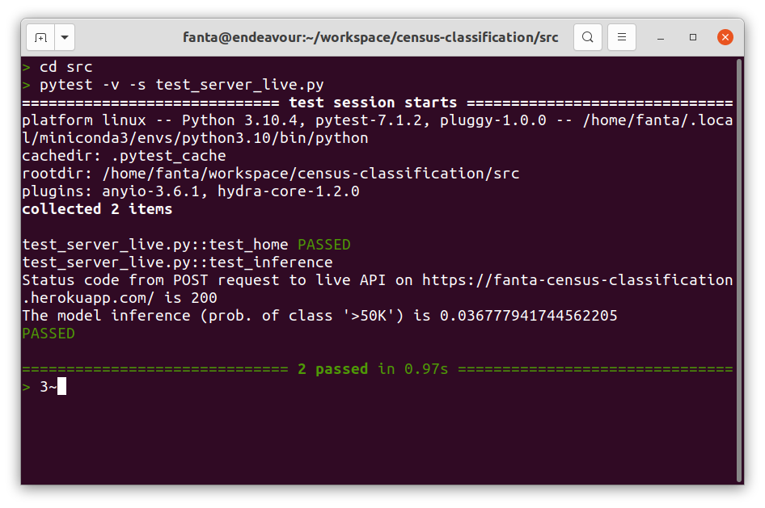

## Installation

Clone the repository

`git clone https://github.com/fantauzzi/census-classification.git`

Ensure the dependencies are installed. The repo comes with a `requirements.txt` for virtualenv
and a `environment.yml` for conda, listing dependencies.

## Running

The project runs with Python 3.10. It has been tested under Ubuntu 20.04.5

To run all scripts first cd into the `src` directory, except for `server.sh` which should be run
from the root of the project. Parameter values are in `src/params.yaml`

To run all tests:

`pytest -v`

To see log prints that are sent to the console:

`pytest -v -s`

To view the EDA run jupyter or jupyter-lab and open `src/eda.ipynb`

The dataset pre-processing reads the file specified by parameter `raw_data` and writes its output
into the file specified by `cleaned_data`. To run it:

`pyton census_preprocess.py`

Run training, cross-validation, model testing and testing of a slice with

`python train.py`

Parameters used for training and cross-validation are in `src/params.yam` under sections
`catboost_classifier` and `catboost_cv` See CatBoost documentation for the parameters of
[CatBoost.cv()](https://catboost.ai/en/docs/concepts/python-reference_cv); `catboost_classifier`
parameters are passed to `cv()` into its parameter `params`, while `catboost_cv` parameters are passed
to `cv()` as named parameters. See in the
[source code](https://github.com/fantauzzi/census-classification/blob/c48386e80898bd2eb125695bc2439ab93afdba36/src/train.py#L44)
.

## Serving

From the root directory of the repo run

`. server.sh`

That will start a [uvicorn](https://www.uvicorn.org/) web server. Opening the server home page
with a browser should show a greeting message. The server implements a REST API that allows to make
inference with the trained model on a given sample. Here an example of running the POST request for
inference, assuming the server is on localhost listening to port 8000:

```shell
curl -X 'POST' \
  'http://127.0.0.1:8000/inference/' \
  -H 'accept: application/json' \
  -H 'Content-Type: application/json' \
  -d '{
  "age": 39,
  "workclass": "State-gov",
  "fnlgt": 77516,
  "education": "Bachelors",
  "education_num": "13",
  "marital_status": "marital-status",
  "occupation": "Adm-clerical",
  "relationship": "Not-in-family",
  "race": "White",
  "sex": "Male",
  "capital_gain": 2174,
  "capital_loss": 0,
  "hours_per_week": 40,
  "native_country": "United-States"
}'
```

## Rubric

Here below a traceability matrix that reports how the project has met each of the requirements,
as set forth in Udacity's [project rubric](https://review.udacity.com/#!/rubrics/4875/view).

### Set up git with GitHub Actions

10 tests have been implemented with Pytest. **Note**: to run them in the repo, first cd into `src`.

Link to the GitHub repo showing actions have been run successfully (on the last commit) on
push to main/master:
[https://github.com/fantauzzi/census-classification/actions](https://github.com/fantauzzi/census-classification/actions)

### Create a machine learning model

Script `src/train.py` splits the dataset into train and test sets (80% and 20% respectively). The
train set is used for training, model selection and hyper-parameters tuning using k-fold
cross-validation. The test set is then used to test the trained model and asses its performance.

- *train, save and load the model and any categorical encoders* in
  function [train_and_save()](https://github.com/fantauzzi/census-classification/blob/c48386e80898bd2eb125695bc2439ab93afdba36/src/train.py#L16)
  ;
- *model inference* in
  function [predict_proba()](https://github.com/fantauzzi/census-classification/blob/c48386e80898bd2eb125695bc2439ab93afdba36/src/train.py#L127)
  ;
- *determine the classification metrics* in
  function [eval_model()](https://github.com/fantauzzi/census-classification/blob/c48386e80898bd2eb125695bc2439ab93afdba36/src/train.py#L63)

The *script that takes in the data, process it, trains the model and saves it and the encoder* is
[`src/train.py`](https://github.com/fantauzzi/census-classification/blob/main/src/train.py)

**Note**: the library used to make and optimize the model, CatBoost, does the categorical encoding
itself, and saves it along with the model. The categorical encoder and the model are saved
together as one file only
in [`src/model/trained_model.bin`](https://github.com/fantauzzi/census-classification/blob/main/model/trained_model.bin)

### Write unit tests

Three unit tests to test model building have been implemented,

```
test_train.py::test_train_and_save PASSED                                [ 80%]
test_train.py::test_predict_proba PASSED                                 [ 90%]
test_train.py::test_eval_model PASSED                                    [100%]
```

### Write a function that computes model metrics on slices of the data

Function [`validate_given_slice()`](https://github.com/fantauzzi/census-classification/blob/c48386e80898bd2eb125695bc2439ab93afdba36/src/train.py#L78)
computes the peformance metrics when the value of a given feature is held fixed.

Function [`validate_model_slice()`](https://github.com/fantauzzi/census-classification/blob/c48386e80898bd2eb125695bc2439ab93afdba36/src/train.py#L96)
computes the performance metrics for a given categorical variable, for each of the values (categories)
the variable can assume.

The script [`src/train.py`](https://github.com/fantauzzi/census-classification/blob/main/src/train.py)
calls `validate_model_slice()` for the `education` variable. See the output in
`screenshots/slice_output.txt`, starting at line #323.

### Write a model card

Provided [here](https://github.com/fantauzzi/census-classification/blob/main/model_card.md).

### Create a REST API

The REST API is implemented
in [`src/server.py`](https://github.com/fantauzzi/census-classification/blob/main/src/server.py)

It implements a GET method on the root domain that returns a greeting message, and a POST method
with path `/inference/`.

Here below a screenshot of the [example used as source](https://fastapi.tiangolo.com/tutorial/schema-extra-example/)
to implement a Pydantic model (Python 3.10).



### Create tests for an API

The three required test cases are implemented in 
['src/test_server.py'](https://github.com/fantauzzi/census-classification/blob/main/src/test_server.py)

```shell
> cd  src
> pytest -v test_server.py
============================= test session starts ==============================
platform linux -- Python 3.10.4, pytest-7.1.2, pluggy-1.0.0 -- /home/fanta/.local/miniconda3/envs/python3.10/bin/python
cachedir: .pytest_cache
rootdir: /home/fanta/workspace/census-classification/src
plugins: anyio-3.6.1, hydra-core-1.2.0
collected 3 items                                                              

test_server.py::test_home PASSED                                         [ 33%]
test_server.py::test_perform_inference_neg PASSED                        [ 66%]
test_server.py::test_perform_inference_pos PASSED                        [100%]

============================== 3 passed in 0.76s ===============================
```

### Deploy an app to Heroku

The app may be available as long as the free tier of Heroku is available at 
[https://fanta-census-classification.herokuapp.com/](https://fanta-census-classification.herokuapp.com/)

Screenshot of the Heroku app configuration with CD enabled.


Screenshot of the brwoser receiving the result of a GET to the root domain.



### Query live API

The script for unit-testing of the live API implements the required POST. The script outputs 
the status code and the inference result when run (from the `src` directory) with

`pytest -v -s test_server_live.py`


